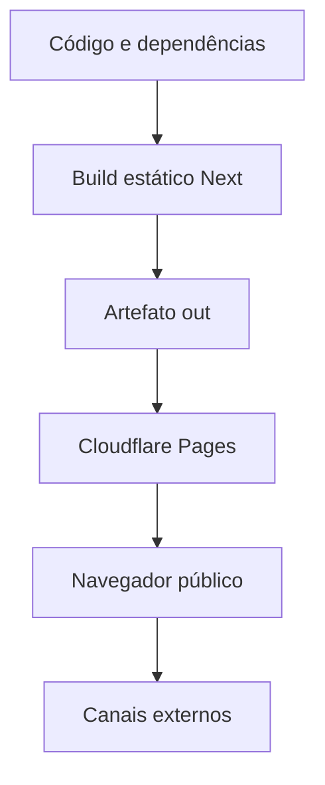

# Modelo de ameaças — portfólio Telma Santos

Data: 27/08/2026

## Executive summary

O sistema é um portfólio público exportado como arquivos estáticos e servido
pelo Cloudflare Pages. A superfície de execução é pequena: não há autenticação,
backend, banco, upload ou dados privados no repositório. Os riscos principais
são a integridade do artefato de publicação, a dependência de scripts inline da
CSP estática e alterações futuras que introduzam conteúdo não confiável ou
integrações de terceiros.

## Scope and assumptions

- Em escopo: `app/`, `components/`, `content/`, `lib/`, `public/_headers`,
  `scripts/`, `next.config.ts`, `package.json`, `package-lock.json` e o fluxo
  de upload descrito no README.
- Fora do escopo: painel administrativo do Cloudflare, DNS, regras WAF não
  visíveis no repositório, provedores de e-mail e WhatsApp, contas de redes
  sociais e a máquina do visitante.
- Uso pretendido: site institucional público com links de contato; o nome e
  os canais publicados são dados deliberadamente públicos.
- Modelo de implantação: `master` recebe merges; após CI verde, o workflow
  `Sync Cloudflare Production Branch` faz fast-forward do commit validado para
  `main`. O Cloudflare Pages `telma-santos` deve observar `main`, executar
  `npm run build` e publicar `out/`. `npm run deploy` é fallback manual.
- Exposição: internet pública em `https://www.telmaformadoraeducacional.com.br`,
  domínio personalizado apontado no Cloudflare; `https://telma-santos.pages.dev`
  continua respondendo como endereço interno do projeto no Pages.
- Autenticação e autorização: não aplicáveis ao conteúdo atual, pois não há
  operação protegida nem estado do usuário.
- Perguntas abertas: confirmar se o domínio definitivo será adicionado depois;
  confirmar se o Pages continuará somente com conteúdo público; confirmar se a
  conta exige WAF, alertas e política de acesso administrativo próprios.

## System model

### Primary components

- Componentes server-side do build: Next.js App Router e TypeScript geram
  HTML, JavaScript, CSS e metadados estáticos (`next.config.ts`, `app/`).
- Componentes client-side: React, Motion e Lenis implementam menu, rolagem,
  animações, abas e links de contato (`components/`, `lib/`).
- Artefato público: `out/`, incluindo `_headers`, páginas, assets e bundles
  do Next.
- Edge de entrega: Cloudflare Pages builda o branch de produção integrado ao
  GitHub e serve o artefato estático para visitantes.

### Data flows and trust boundaries

- Desenvolvedor e dependências → build Next.js: código, conteúdo, imagens e
  pacote lockfile atravessam o limite de build local; o lockfile e o build
  determinam o artefato, mas scripts de instalação continuam sendo uma fronteira
  de cadeia de suprimentos.
- GitHub → Cloudflare Pages: CI verde em `master` autoriza fast-forward para
  `main`; o push em `main` deve acionar o build integrado do Pages. O
  Wrangler é apenas caminho de recuperação manual.
- Cloudflare Pages → navegador: HTML, JS, CSS, fontes e imagens atravessam
  HTTPS; `_headers` entrega CSP, HSTS, `X-Frame-Options`, `nosniff`, COOP,
  Referrer-Policy e Permissions-Policy.
- Navegador → links externos: o visitante envia a ação para WhatsApp, e-mail,
  Instagram ou LinkedIn; o site não recebe de volta dados por API e não grava
  sessão ou cookies próprios.

#### Diagram

## Assets and security objectives

| Asset | Why it matters | Security objective (C/I/A) |
|---|---|---|
| Artefato `out/` | É o conteúdo que o visitante recebe e que define a identidade do site. | Integridade e disponibilidade (I/A) |
| Conteúdo, links e metadados | Alteração pode causar fraude, perda de contato ou dano reputacional. | Integridade (I) |
| Imagens e fontes públicas | Afetam identidade, acessibilidade e desempenho, mas não são secretas. | Integridade e disponibilidade (I/A) |
| Integração GitHub ↔ Cloudflare | Controla o build/deploy automático; comprometimento pode adulterar a produção. | Confidencialidade e integridade (C/I) |
| Dependências e lockfile | Código de build e runtime pode alterar o artefato publicado. | Integridade (I) |

## Attacker model

### Capabilities

- Atacante remoto pode solicitar páginas e assets públicos, usar URLs
  malformadas, tentar framing, observar headers e interagir com links.
- Atacante pode explorar uma dependência comprometida ou uma alteração de
  código que introduza XSS, se o processo de revisão/publicação aceitar o
  artefato.
- Atacante na mesma rede do desenvolvedor pode alcançar o servidor local de
  pré-visualização se ele estiver exposto pela máquina.

### Non-capabilities

- Não há evidência de que o atacante controle `site-data.ts`, o repositório, a
  integração GitHub/Cloudflare ou a conta Cloudflare; esses são cenários de comprometimento
  de desenvolvimento/CI, não uma entrada pública do site.
- Não há API, banco, cookie próprio, upload ou endpoint de mutação para atacar.

## Entry points and attack surfaces

| Surface | How reached | Trust boundary | Notes | Evidence |
|---|---|---|---|---|
| Páginas e assets | GET/HEAD na URL pública | Pages → navegador | Conteúdo público, sem sessão. | `next.config.ts`, `app/` |
| Menu e abas | Eventos de clique e teclado | navegador → componentes React | Dados vêm de constantes do repositório. | `components/layout/SiteMenu.tsx`, `components/sections/AreasDeAtuacao.tsx` |
| Links de contato | Clique em `wa.me`, `mailto`, Instagram e LinkedIn | navegador → terceiros | Não há retorno de dados para o site. | `content/site-data.ts`, `lib/whatsapp.ts` |
| Headers de segurança | Resposta HTTP no Pages | Pages → navegador | Inclui CSP e defesa contra framing. | `public/_headers` |
| Pré-visualização local | Requisições HTTP na porta 4321 | rede local → script Node | Não é runtime de produção; validação de caminho foi corrigida. | `scripts/serve-with-headers.mjs` |
| Cadeia de build | `npm ci`, `npm run build`, integração Pages | dependências/GitHub → artefato | Risco de supply chain e publicação incorreta. | `package.json`, `package-lock.json`, `.github/workflows/` |

## Top abuse paths

1. Comprometimento de dependência → execução no build → alteração do HTML ou
   bundle → publicação de conteúdo malicioso.
2. Alteração futura de conteúdo externo → renderização via sink HTML ou URL
   perigosa → XSS no domínio público → roubo de dados de uma futura sessão ou
   adulteração da página.
3. Uso do servidor local em rede compartilhada → caminho malformado → leitura
   de arquivo fora de `out` → exposição de arquivos locais; a validação atual
   bloqueia esse caminho.
4. Integração Git desconectada/pausada ou branch de produção divergente →
   `main` não é consumida pelo Pages → produção permanece em versão antiga.
5. Regressão futura de CORS para origem curinga → leitura cross-origin por
   qualquer origem → risco de exposição caso o domínio passe a servir dados
   não públicos. O artefato atual restringe CORS ao domínio canônico.

## Threat model table

| Threat ID | Threat source | Prerequisites | Threat action | Impact | Impacted assets | Existing controls (evidence) | Gaps | Recommended mitigations | Detection ideas | Likelihood | Impact severity | Priority |
|---|---|---|---|---|---|---|---|---|---|---|---|---|
| TM-001 | Cadeia de suprimentos | Dependência ou script de build comprometido | Executar código no build e modificar `out/` | Site adulterado | Artefato, conteúdo | lockfile; `npm audit`; revisão; build estático | Não há verificação de assinatura do artefato | Usar `npm ci`, revisão de lockfile, proteção de branch e checagem de hash/preview antes do deploy | Alertar mudanças inesperadas em lockfile e no bundle; comparar deployment com commit | baixa | alta | medium |
| TM-002 | Alteração futura do código | Novo dado externo chega a JSX, URL ou sink DOM | Inserir script, URL ativa ou markup não sanitizado | XSS no domínio público | Conteúdo e futura sessão | React escapa JSX; CSP de scripts usa hashes SHA-256, `script-src-attr 'none'`, `base-uri 'none'` e `form-action 'none'`; o build rejeita handlers inline e `javascript:` | `style-src` ainda usa `unsafe-inline` para estilos do React/Motion | Manter conteúdo estruturado, validar esquemas de URL, evitar sinks e reavaliar CSP ao adicionar integrações | Teste automatizado do artefato e revisão de qualquer terceiro | baixa | alta | medium |
| TM-003 | Atacante na rede local | Servidor `preview:headers` em execução e alcançável | Enviar traversal ou método inesperado | Leitura local ou abuso do processo | Arquivos do desenvolvedor | validação com `path.relative`; somente GET/HEAD; 400 para URI inválida | O script ainda é uma ferramenta local e não deve ser exposto | Vincular a loopback se o uso em rede não for necessário | Teste de traversal e monitoramento do processo/porta 4321 | baixa | média | low |
| TM-004 | Operador ou automação de deploy | Acesso de escrita ao repositório ou à integração Pages | Enviar código/artefato indevido ao branch de produção | Indisponibilidade ou fraude reputacional | Artefato, integridade da URL | PR/CI em `master`; sync somente após CI verde; `main` como branch de produção; healthcheck externo | Integração Cloudflare pode ser desconectada ou ter automatic deployments pausados | Proteger branches/integração e exigir checks | Alertas de deployment e correlação commit ↔ produção | baixa | alta | medium |
| TM-005 | Origem web arbitrária | Regressão futura de CORS ou conteúdo privado no mesmo domínio | Ler recurso cross-origin | Exposição cross-origin | Dados futuros | `Access-Control-Allow-Origin` restrito ao domínio canônico e gate que rejeita `*`; hoje não há cookies/API | Configuração edge pode regredir fora do código | Manter healthcheck de produção e rever CORS antes de qualquer API/dado privado | Teste de headers em cada release e inventário de recursos públicos | baixa | média | low |

## Criticality calibration

- **Critical:** execução remota ou comprometimento da conta Cloudflare com
  impacto em usuários; exemplos: token de publicação exposto no bundle, XSS
  armazenado que roube sessão futura, ou pipeline publicando código arbitrário.
- **High:** adulteração persistente da página pública, exposição de dado não
  público ou indisponibilidade ampla; exemplos: dependência comprometida,
  deploy malicioso aceito ou futura API sem controle de acesso.
- **Medium:** enfraquecimento de defesa com pré-condição adicional; exemplos:
  regressão da CSP/CORS ou deploy manual sem revisão.
- **Low:** impacto local, informativo ou dependente de dado que hoje não existe;
  exemplos: traversal no preview local corrigido, CORS em assets públicos e
  header de hardening ausente.

## Focus paths for security review

| Path | Why it matters | Related Threat IDs |
|---|---|---|
| `public/_headers` | Define CSP, framing, HSTS e permissões do navegador. | TM-002, TM-005 |
| `scripts/serve-with-headers.mjs` | Serve o build local e manipula caminhos HTTP. | TM-003 |
| `package.json` e `package-lock.json` | Definem dependências, scripts e publicação. | TM-001, TM-004 |
| `next.config.ts` | Define o limite entre runtime dinâmico e export estático. | TM-001, TM-002 |
| `content/` e `lib/whatsapp.ts` | Mantêm conteúdo e destinos de links públicos. | TM-002, TM-005 |
| `components/` | Contém os sinks de renderização e eventos do navegador. | TM-002 |

## Notes on use

Este modelo foi construído com o contexto disponível no repositório e no
projeto Pages. As perguntas abertas em “Scope and assumptions” devem ser
respondidas antes de adicionar autenticação, conteúdo vindo de CMS, APIs,
analytics, domínio personalizado ou assets privados. A ausência desses
componentes foi tratada como uma conclusão baseada em evidência do código,
não como garantia sobre configurações externas da conta Cloudflare.
